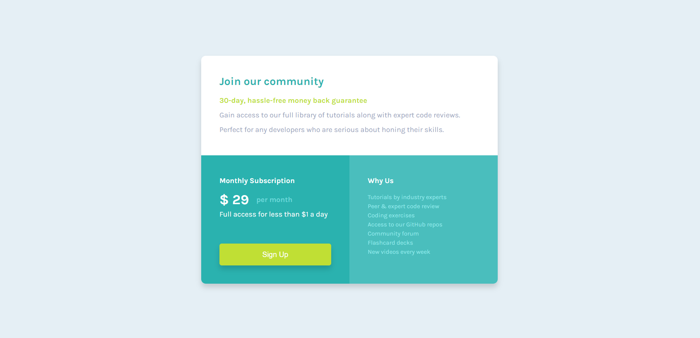

# Frontend Mentor - Single price grid component solution

This is a solution to the [Single price grid component challenge on Frontend Mentor](https://www.frontendmentor.io/challenges/single-price-grid-component-5ce41129d0ff452fec5abbbc). Frontend Mentor challenges help you improve your coding skills by building realistic projects. 

## Table of contents

- [Overview](#overview)
  - [The challenge](#the-challenge)
  - [Screenshot](#screenshot)
  - [Links](#links)
- [My process](#my-process)
  - [Built with](#built-with)
  - [What I learned](#what-i-learned)
  - [Useful resources](#useful-resources)
- [Author](#author)


**Note: Delete this note and update the table of contents based on what sections you keep.**

## Overview

### The challenge

Users should be able to:

- View the optimal layout for the component depending on their device's screen size
- See a hover state on desktop for the Sign Up call-to-action

### Screenshot



### Links

- Solution URL: [](https://your-solution-url.com)


## My process

### Built with

- Semantic HTML5 markup
- CSS custom properties
- Flexbox
- CSS Grid


### What I learned

I have, for a first time, worked with <pre> so I could see how it behaves:

```html
          <pre>
Tutorials by industry experts
Peer &amp; expert code review
Coding exercises
Access to our GitHub repos
Community forum
Flashcard decks
New videos every week</pre>
```

I have also worked with mobile verison and @media screen for a first time:

```css
/* mobile version */
@media screen and (max-width: 376px){
    body{
        width: 100%;
        height: auto;
    }
    main{
        display: flex;
        flex-wrap: wrap;
        margin: 72px 32px 75px;
        height: auto;
    }
    section{
        width:100%;
        height: auto;
        padding:30px;
    }
}
```

### Useful resources

- [Example resource 1](https://www.w3schools.com/howto/howto_js_topnav_responsive.asp) - This helped me for responsive layout. I really liked this pattern and will use it going forward.


## Author

- Frontend Mentor - [@franekbu](https://www.frontendmentor.io/profile/franekbu)

